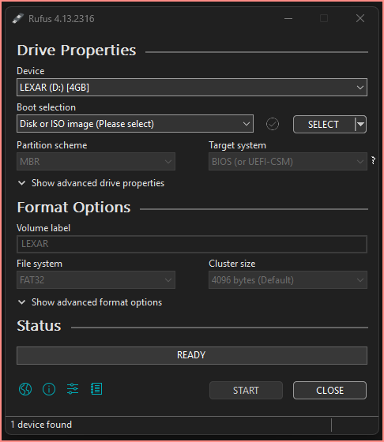
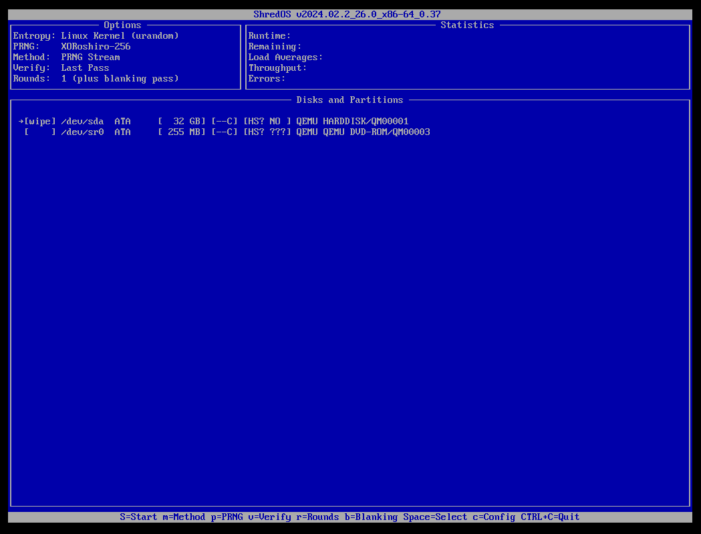

## Overview
This document is about completely wiping the storage disk within a laptop computer before recycling or donating the computer. The goal is that not even the bad guys could easily retrieve personal, financial, or other confidential information from your computer.

It isn't a one-stop-shop, i.e., not a simple cookbook that you follow and are done.  I've tried to make it less techie, but unfortunately some techieness remains 🤔

Overview of the process:
1. Try to use your own computer's BIOS to securely erase the disk. Recent computers are likely to have this option. If your computer has this, use it and you're done. Otherwise work through the remaining steps.
2. Create a bootable USB memory stick (a.k.a. USB thumb drive or USB flash drive) containing specialized tools. 
3. Restart your computer to boot from the memory stick.
4. Determine whether your computer has a rotating hard drive (HHD) or a solid state drive (SSD)
5. If HDD, use the `nwipe` interactive utility to overwrite the contents of your drive
6. If SSD, use command-line utilities to sanitize the drive.

## Step1: Use machine's BIOS secure erase if available
On many modern computers, the BIOS already has secure erase capabilities. If it does, that will be the easiest and most reliable way erase your disk in preparation for selling or recycling your computer. Here is how to use this approach.

#### Getting into your BIOS setup
You will need to interrupt your computer's startup process in order to direct the machine to the *BIOS setup*.  To do this you'll need to know what special "BIOS setup key" (sometimes called "Boot menu key" or something else) the manufacturer of your computer uses. [Tom's Hardware](https://www.tomshardware.com/reviews/bios-keys-to-access-your-firmware,5732.html) has a partial list (see heading "BIOS Keys by Manufacturer") or you can do an internet search for "BIOS setup" and your computer manufacturer.

Starting with the machine turned off, power up the machine and *immediately* start tapping the manufacturer-specific "BIOS setup key" _about 2 times a second_.  You may have to press this a number times to get the computer to see it. You'll know that it has because it will indicate it is going to a boot menu instead of Windows or whatever you had.

Once you see the Boot menu, use the keyboard, if necessary, to navigate to BIOS Setup.

#### Find the BIOS secure erase
This will be a hunting game. Use the arrow, Enter, and Esc keys (or whatever the screen tells you) to navigate around the BIOS Setup and look for key words like "erase", "wipe", "format", "sanitize", etc.. You many need to go through a number of BIOS setup selections to find it. On my (Dell) computers it is within the *Maintenance* section. 

If you find it, follow the instructions. You will likely have to give multiple confirmations because the manufacturers know this operation erases *everything* on your computer, even the Windows or other operating system itself.

If successful, try to restart your computer and it should tell you it couldn't find a system to start, or something similar, in which case you are done. 

If the BIOS doesn't have this capability, then  proceed to the following steps.

## Step 2: Create a bootable USB stick containing ShredOS
[ ShredOS](https://github.com/PartialVolume/shredos.x86_64) is USB bootable system put together for the sole purpose of securely erasing the entire contents of your disks — a.k.a. wiping the disk — whether they be HDD or SSD. It supports either 32bit or 64bit Intel-based computers, so all PCs (Windows or Linux) and most modern Macs. Because it boots from a USB thumb drive, it doesn't care what operating system previously existed on the machine.

You will need a USB thumb drive on which there is nothing of value. Important: All contents will be erased in this process.  It doesn't have to be large — probably anything you have on hand will do.

#### If you have a functioning Windows machine:
- Download the latest Rufus .exe from https://rufus.ie/en/
	- If you are the cautious type, right-click on the downloaded .exe file and select _Scan with Microsoft Defender_ (or whatever anti-virus program you use)
- Download the latest ShredOS image from https://github.com/PartialVolume/shredos.x86_64/tags. As of this writing it is called `v2025.11_28_x86-64_0.40` but is an active project so you might get something newer and better
- Insert USB stick into computer 
	- Note which drive-letter Windows assigned it, e.g., `D:`
- Double-click the Rufus exe to launch the program. 
	- You should get a *User Account Control* dialog asking if you want to allow this program to make changes on your device. 
	- Confirm that the dialog says *Verified Publisher: Akeo Consulting*. 
	- If it doesn't say that, click *No* and go get a fresh copy of Rufus. 
	- Otherwise click *Yes*.
- You'll see something like: 



- Verify that the _Device_ listed matches your USB memory stick. If it doesn't, then use the drop-down to select the correct memory stick.
- Click the _SELECT_ button and navigate to the ShredOS image previously downloaded, select it and click _Open_
- Assuming Rufus is happy, you will see the _Start_ button enabled, so click it.
- When it finishes, close Rufus.
- Before ejecting the USB stick, you may want to consider some of the customizations suggested in the ShredOS documentation. You don't have to do these, but may find them helpful, though directions are a bit techie:
	- [Exclude the FAT formatted ShredOS Boot drive from Nwipe, interactive and autonuke modes](https://github.com/PartialVolume/shredos.x86_64?tab=readme-ov-file#how-to-exclude-the-fat-formatted-shredos-boot-drive-from-nwipe-interactive-and-autonuke-modes)
		- This prevents ShredOS from inadvertently trying to wipe the device it is running from. (seems like that should have been an obvious configuration)
	- [Make a persistent change to the terminal resolution](https://github.com/PartialVolume/shredos.x86_64?tab=readme-ov-file#how-to-make-a-persistent-change-to-the-terminal-resolution)
		- The default window resolution is small -- just 640x480. You are probably using a larger screen than that, so increasing the "terminal resolution" might be helpful. Something like the suggested 1024x768x16 will work on most computers these days.
- Finally, eject the USB memory stick and label it _ShredOS_ or something similar.

#### If you are a Linux or Mac user:
- You'll use [something like](https://github.com/PartialVolume/shredos.x86_64?tab=readme-ov-file#linux-and-mac-users) `sudo dd if=shredos.img of=/dev/sdx` but you're on your own to learn the details. 

#### Advanced users:
- You can put multiple boot images on a single USB memory stick using [Ventoy](https://github.com/ventoy/Ventoy)

## Step 3: Restart your computer to boot from the ShredOS memory stick.
Summary: If it is on, shut down the computer you want to wipe. Then plug the ShredOS USB stick into an available USB port on the computer and force the computer to boot from it instead of the built-in disk.

All computers are *capable* of booting from a USB memory stick, but most computers are configured to prioritize booting from the main disk even if a bootable USB stick is present. This means you have to intervene in the computer start up to make it boot from the USB.

To do this you'll need to know what special "boot menu key" the manufacturer of your computer has used. Techofide has [a useful list](https://techofide.com/blogs/boot-menu-option-keys-for-all-computers-and-laptops-updated-list-2021-techofide/#:~:text=At%20the%20point%20when%20a,Esc) to which you should refer before going to the next step.

Starting with the machine turned off, insert the ShredOS USB stick. Power up the machine and *immediately* start tapping the manufacturer-specific "Boot menu key" about twice a second.  You may have to do this for several seconds to get the computer to see it. You'll know that it has because it will indicate it is going to a boot menu instead of Windows or whatever you had.

Once you see the Boot menu, use the keyboard to select the USB Memory stick and press Enter to boot up the ShredOS system.

**Alternate method for Windows 10/11**:  
- Start up Windows and log in.
- Navigate to Settings > Update & Security > Recovery
- under Advanced startup, click Restart Now 

### ShredOS windows overview
ShredOS has four "terminals" which can be selected using the ALT key:
- ALT-F1 Where `nwipe` is initially launched; this is the tool to be used to wipe a HDD
- ALT-F2 A virtual terminal, typically used to run command-line tools such `fdisk` and `hdparm`. Admittedly this is kind-of techy, but this is what you'll use to wipe an SSD.
- ALT-F3 Console log, login required which is root with no password
- ALT-F4 SMART Monitoring Terminal. 

By default, the ShredOS starts in the ALT-F1 window where `nwipe` is running. This will show as a blue and white window similar to:

Note the single key commands identified across the bottom.

Before doing anything else, let's...

### Step 4: Determine whether it is HDD or SSD
There are two kinds of storage "disks" that you might encounter:
- Older computers have mechanically rotating disks called a Hard Disk Drive (HDD)
- Newer computers use solid state devices and are called a Solid State Drive (SSD)

These two types require *two different techniques* to securely erase them. So it is essential that  you know which kind your computer has.

Since you have already booted your machine into ShredOS, the easiest way to determine this is to:
- Switch over to the virtual terminal by pressing Alt-F2
- You'll see a screen that is all blank except for a prompt ending in `#` (mine says `sh-5.2#`). You will type in commands after this prompt.
- type in the command `fdisk -l` followed by the Enter key. You should see output such as the following:
```
sh-5.2# fdisk -l
Disk /dev/sda: 465.76 GiB, 5001078862016 bytes, ....
Disk model: ST8500423AS
...
Disk /dev/sdb: 14.76 GiB 158460800512 bytes, ...
Disk model: YesVideoUSB
...
sh-5.2# 
```
(you will see more information rather than the ellipses but that information is not relevant for this process.)

This shows there are two storage drives — `/dev/sda` and `/dev/sdb` (you may see more) — one of which has much larger capacity than the other: almost 455 GB vs almost 15 GB. So you likely are wanting to erase the larger one.

In my case, also I know the "YesVideoUSB" is actually the brand of USB stick from which I booted, so the other must be the drive that I want to erase. 

There are multiple ways to find out whether a specific drive is an HDD or an SSD.

A. You may be able to just do an internet search on the disk model revealed by the `fdisk` command, which, in this instances, delivers:

>The **Seagate Momentus 7200.4 ST9320423AS** is a 320GB 2.5-inch internal laptop hard drive featuring a SATA 3Gb/s interface, 7200 RPM rotational speed, and 16MB cache.

so I know it is *rotating* HDD rather than an SSD.

B. Run `lsblk -d -o name,rota` to see all devices. In my case I see:
```
sh-5.2# lsblk -d -o name,rota /dev/sda
sda   1
sh-5.2#
```

The ROTA (rotation) value will be:
- `0` if it is an SSD; 
- `1` if it is an HDD.

C. Run `hdparm -I /dev/sda` and look for specific information:
```
sh-5.2# hdparm -I /dev/sda | grep -i rotation
Nominal Media Rotation Rate: 7200
sh-5.2#
``` 

If it was an SSD the result would be
```
sh-5.2# hdparm -I /dev/sda | grep -i rotation
Nominal Media Rotation Rate: Solid State Drive
sh-5.2# 
```

Proceed to step 5 or 6 based on whether the drive you want to erase is rotating (HDD) or solid state (SSD), 

### Step 5: For any HDD:
For rotating hard drives, the secure erase process involves overwriting every digital byte of the drive which, for a 500GB drive, can take 8 to 12 hours. For the highest level of safety, every byte should be written (with a different values) multiple times, so the whole process is very long, indeed.

The `nwipe` utility (Alt-F1 window for ShredOS) provides numerous erase methods to choose from, including:
- Fill With Zeros - Fills the device with zeros (0x00).
- Fill With Ones - Fills the device with ones (0xFF).
- RCMP TSSIT OPS-II - Royal Canadian Mounted Police Technical Security Standard, OPS-II
- DoD Short - The American Department of Defense 5220.22-M short 3 pass wipe (passes 1, 2 & 7).
- DoD 5220.22M - The American Department of Defense 5220.22-M full 7 pass wipe.
- Gutmann Wipe - Peter Gutmann's method (Secure Deletion of Data from Magnetic and Solid-State Memory).
- PRNG Stream - Fills the device with a stream from the PRNG (Pseudo-Random Number Generator)
- HMG IS5 enhanced - Secure Sanitisation of Protectively Marked Information or Sensitive Information

For home computers, I'd recommend *DoD Short* which is 3 passes the last of which is to write random values.  If you're in a hurry and not as concerned with someone reading your data (e.g., you're giving the computer to someone you know) the *PRNG Stream* is probably sufficient.

The steps are:
- Boot the computer from the ShredOS USB if you haven't done that.
- If you're not on the `nwipe` window, press Alt-F1 to get there
- Keep an eye on the key-stroke commands listed at the bottom of the window... this is how you control `nwipe`
- Use the `m` key to select the desired erase method; 
	- use up/down keys to navigate list; space to select and go back to main screen
- Use up/down arrows and space key to select which HDD(s) to erase. Make sure you select only the one(s) you want to erase!
- Press `S` key to start the wipe process
- Find other things to do for the rest of the day :-) 

### Step 6: For any SSD:

For SSD storage devices the process is called _sanitizing_ and doesn't actually take very long. If you can do it from the BIOS (See [Step1: Use machine's BIOS secure erase if available](#step1-use-machines-bios-secure-erase-if-available)), that is the preferred method.

If the BIOS approach isn't available, you'll have to use the ShredOS virtual terminal (Alt-F2). For detailed instructions, please refer [ShredOS documentation](https://github.com/PartialVolume/shredos.x86_64?tab=readme-ov-file#wipe-ssd-and-nvme-using-hdparm-and-nvme-cli). (Note that section covers both SSD and NVME; you likely won't have or need to sanitize NVME so can ignore that part of the instructions, but if you do you'll already know that ;-)

# References:
- ShredOS: https://github.com/PartialVolume/shredos.x86_64
- Rufus: [https://rufus.ie/en/](https://rufus.ie/en/)
- Identifying HHD v SSD tutorial: [https://www.tutorialspoint.com/article/check-if-hard-drive-is-ssd-or-hdd-on-linux](https://www.tutorialspoint.com/article/check-if-hard-drive-is-ssd-or-hdd-on-linux) 
